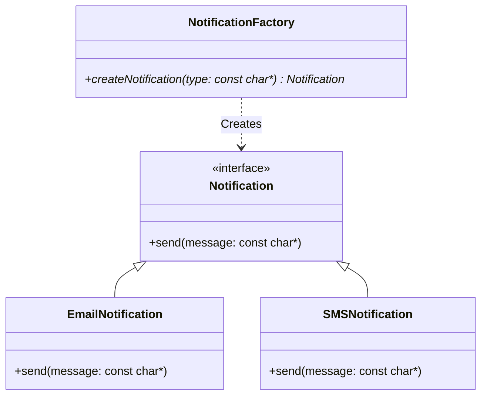

📊 Faz 1: Mimari ve UML Diyagramları
Bu bölümde, projenin ilk aşamasında nesne yaratma sorumluluğunun nasıl merkezi bir yapıya (Factory Method) taşındığı görselleştirilmiştir.

🏗️ Nesne Yaratma Sorunu ve Çözümü (Factory Method)
Önceki Durum: Nesneler doğrudan kod içinde new operatörü ile oluşturuluyordu.

Sonraki Durum (Çözüm): NotificationFactory sınıfı eklenerek nesne oluşturma mantığı tek bir merkezde toplandı.

🚀 Not: Bu diyagram, phase-1 kapsamında uygulanan Factory Method örüntüsünün sınıf yapısını göstermektedir.
